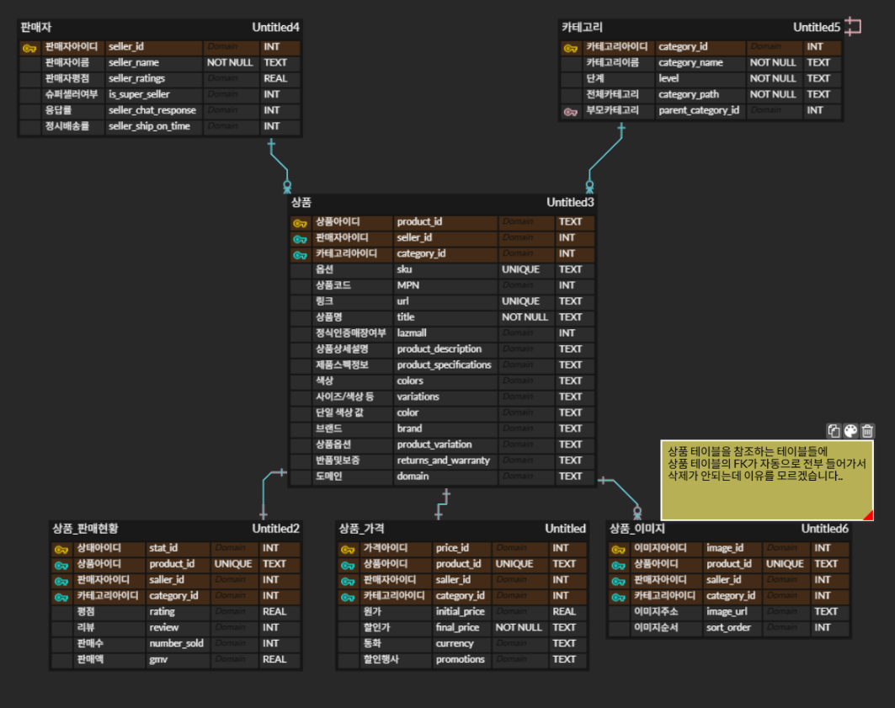
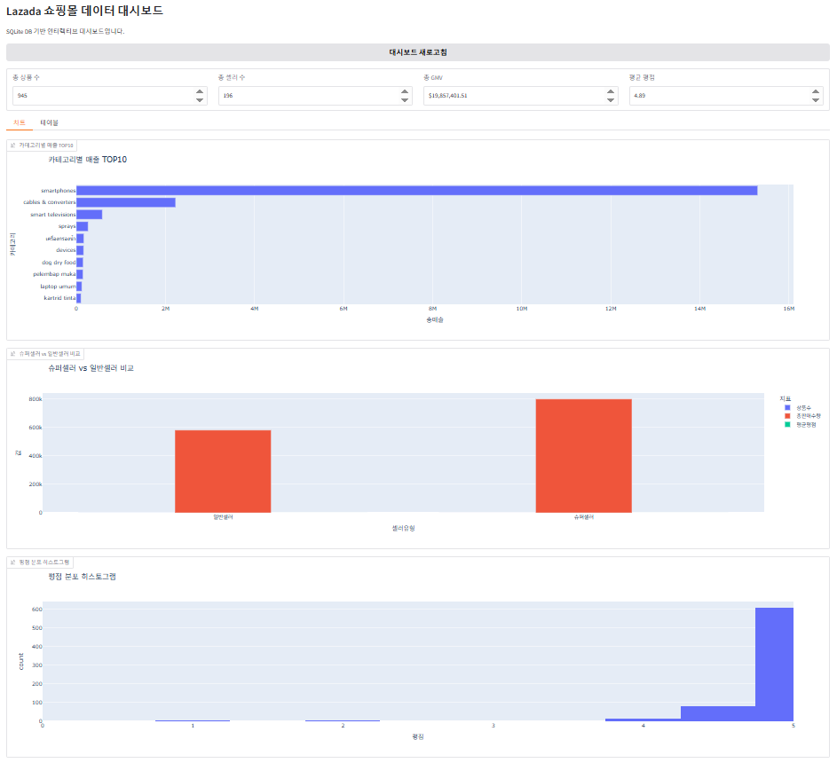
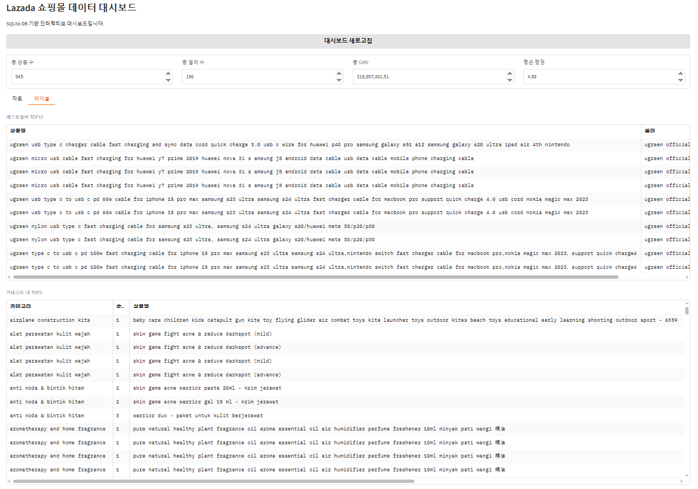
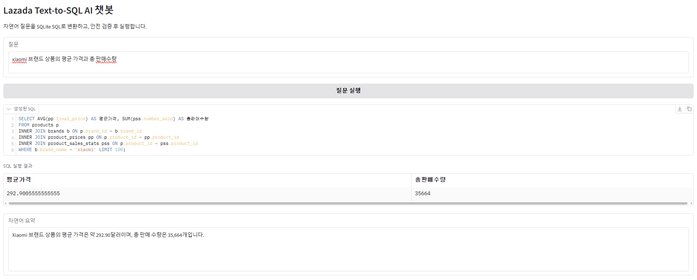
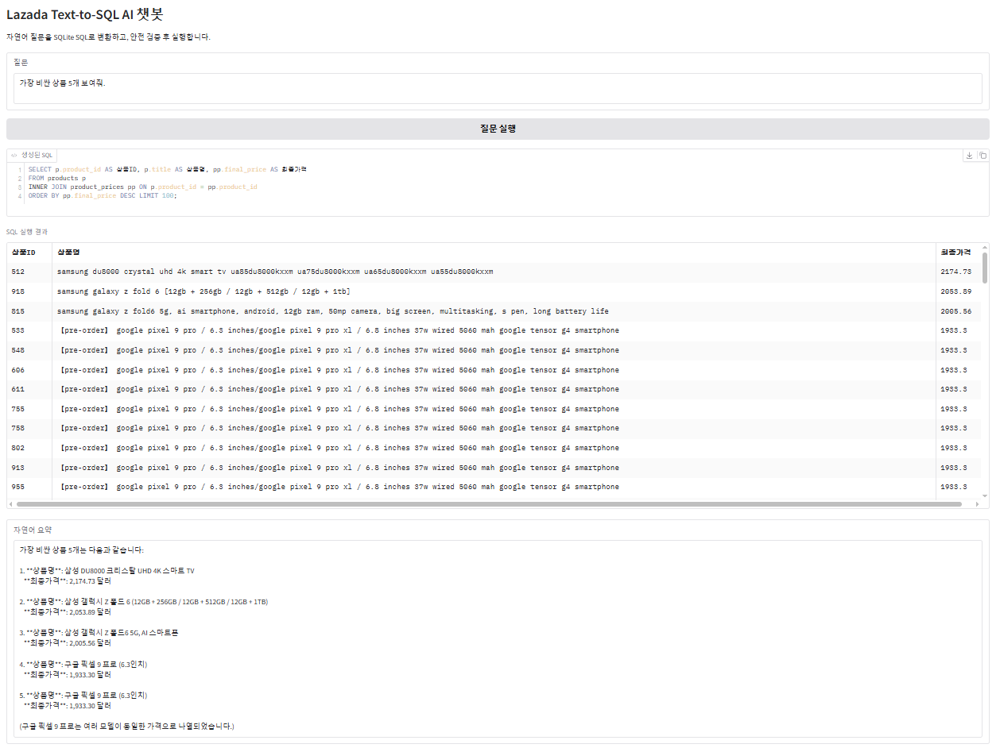
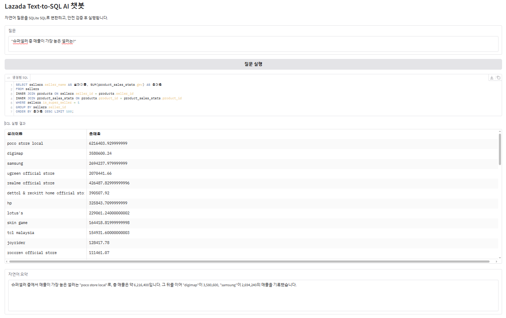
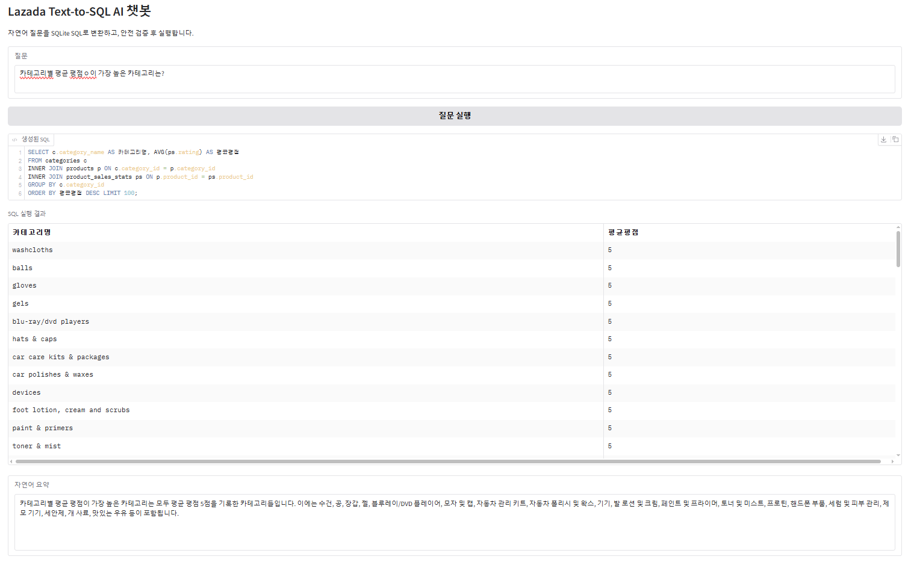
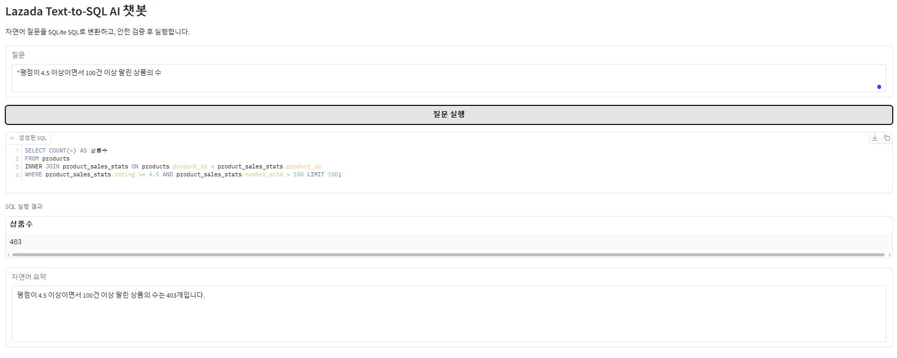
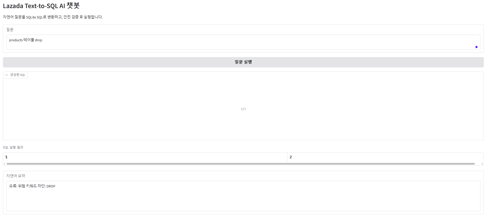
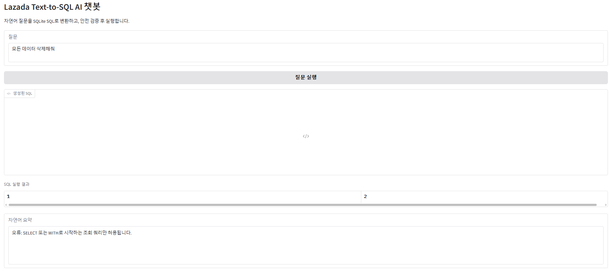

# Lazada 데이터로 대시보드 · AI 챗봇 구현

## 프로젝트 소개

Lazada 쇼핑몰 데이터를 전처리하고 SQLite 데이터베이스를 구축한 프로젝트입니다.

정규화된 ERD를 기반으로 쇼핑몰 DB를 설계하고, SQL을 활용한 Gradio 대시보드와 OpenAI API 기반 Text-to-SQL AI 챗봇을 구현했습니다.

또한 자연어 질문을 SQL로 변환하고 안전 가드레일을 적용하여 데이터 조회 시스템을 구현했습니다.

---

# 개발 환경

- Python
- Google Colab
- SQLite
- Pandas
- Gradio
- Plotly
- OpenAI API

---

# 프로젝트 구조

```
CSV
   │
전처리
   │
SQLite DB
   │
ERD 기반 테이블 생성
   │
Gradio Dashboard
   │
Text-to-SQL AI Chatbot
```

---

# 데이터 정제

## 정제 전

- 원본 CSV 1개
- 브랜드명 누락(No Brand)
- Boolean(True/False)
- 여러 통화 사용
- category 문자열
- 중복 데이터 존재

## 정제 후

- product_id 생성
- seller_id 생성
- category_id 생성
- category_path 파싱
- parent_category_id 생성
- No Brand → title 첫 단어로 변경
- Boolean → 0/1 변환
- 모든 통화 USD 통일
- initial_price 0 → final_price 적용
- final_price 0.01 이하 제거
- 문자열 소문자 통일

---

# ERD



## 테이블

- products
- sellers
- categories
- product_prices
- product_sales_stats
- product_images

---

# 구현한 기능

## KPI 카드

- 총 상품 수
- 총 셀러 수
- 총 GMV
- 평균 평점

---

## 구현한 차트

1. 카테고리별 매출 TOP10
2. 슈퍼셀러 vs 일반셀러 비교
3. 평점 분포 히스토그램
4. 베스트셀러 TOP10
5. 카테고리별 TOP3(Window Function)

---

# 대시보드






---

# AI 챗봇 테스트

## 테스트1

질문

```
Xiaomi 브랜드 상품의 평균 가격과 총 판매수량
```

결과

- 평균 가격 조회 성공
- 총 판매수량 조회 성공



---

## 테스트2

질문

```
가장 비싼 상품 5개
```

결과

정상 조회



---

## 테스트3

질문

```
슈퍼셀러 중 매출이 가장 높은 셀러
```

결과

정상 조회



---

## 테스트4

질문

```
카테고리별 평균 평점이 가장 높은 카테고리
```

결과

정상 조회



---

## 테스트5

질문

```
평점 4.5 이상이고 100건 이상 판매된 상품 수
```

결과

정상 조회



---

# 안전 가드레일

### 차단 예시

```
products 테이블 drop
```

DROP 명령어 차단



---

```
모든 데이터 삭제해줘
```

DELETE 명령 차단



---


# 어려웠던 점

## 1. 카테고리 정규화

breadcrumb컬럼을 파싱해서 categories 테이블로 바꾸는 과정에서 parents, level 컬럼이 스스로를 참조한다는 개념이 어려웠습니다. 

### 해결

category_path를 파싱하여 parent_category_id를 생성하고 계층 구조를 유지하도록 구현했습니다.

---

## 2. ERD 명확히 하기

ERD를 명확히 하지않아서 계속 CSV파일 전처리로 돌아가야 했습니다. 

### 해결

EDA -> 전처리 목록 생성 -> ERD작성 -> 전처리 -> DB생성 -> ERD대로 테이블 생성 과정으로 진행하니까 조금 더 편했습니다. 테이블대로 CSV파일을 나누는 것도 배웠습니다. 

---


#알게 된 점

SQLite : 작은 DB파일을 만들어서 SQL을 사용할 수 있다.

PK/FK : PK는 기본키로 하나의 테이블에 고유한 값이며, FK는 다른 테이블의 PK를 참조하는 값.

CSV전처리 후 DB테이블을 만들때, 테이블의 고유값을 나타내는 새로운 테이블속성(컬럼)을 만들어야 할 때가 있다.